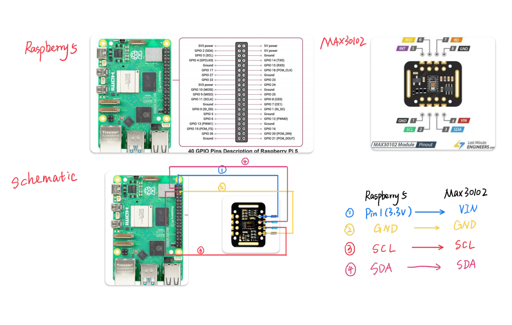

# ENG5220-VibePulse
## Realtime Heart-Rate–Driven Adaptive Music System

University of Glasgow — ENG 5220: Real Time Embedded Programming Team Project

<br />
<p align="center">
  <a href="https://github.com/Zonlywyh/ENG5220-VibePulse">
    
  </a>

  <h3 align="center">VibePulse</h3>

  <p align="center">
    Realtime Heart-Rate–Driven Adaptive Music System
    <br />
    <a href="https://github.com/Zonlywyh/ENG5220-VibePulse">
      <strong>Explore the project »</strong>
    </a>
    <br />
    <br />
    <a href="https://github.com/Zonlywyh/ENG5220-VibePulse">Demo</a>
    ·
    <a href="https://github.com/Zonlywyh/ENG5220-VibePulse/issues">Report Bug</a>
    ·
    <a href="https://github.com/Zonlywyh/ENG5220-VibePulse/issues">Request Feature</a>
  </p>
</p>

---

## 🚀 Introduction
VibePulse is a professional-grade, **event-driven embedded system** built on Linux (Raspberry Pi). It solves the real-world challenge of physiological state management by continuously monitoring heart-rate signals (PPG), inferring stress/relaxation states, and dynamically adapting music playback in realtime.

## 🧠 Real-Time Implementation & DSP
*In accordance with ENG 5220 marking criteria, this project is mainly event-driven and uses callbacks, blocking I/O, and worker threads to ensure high responsiveness.*

* **Event-Driven Architecture**: Processing is triggered by hardware events and handled via **asynchronous callbacks** and **timers**.
* **Multithreading**: We employ thread-based event handling (waking up threads) to ensure the system remains responsive, preventing the software from entering an unresponsive wait state.
* **DSP Pipeline**:
    * **High-Pass Filter**: DC removal to eliminate static tissue interference.
    * **Low-Pass Filter**: Removes high-frequency electrical artifacts.
    * **Quantitative Assessment**: Latencies are monitored to ensure data acquisition and music adaptation happen within defined tolerances.


## 💻 Software Structure & Reliability
*Our code is structured using Object-Oriented principles to guarantee high reliability and ease of maintenance.*

* **SOLID Principles**: The choice of classes is guided by SOLID principles to ensure clear encapsulation and rationale.
* **Encapsulation**: Internal data is strictly private. We use safe getters, setters, and callback interfaces to manage data flow between threads without memory leaks.
* **Failsafe Design**: The application is designed to be leak-free, ensuring it can run as a standalone embedded product upon boot-up.

### . Hardware Rationale
* **I2C Protocol**: We utilized the RPi 5's dedicated I2C pins (GPIO 2/3) for high-speed, reliable sensor data acquisition.
* **Voltage Regulation**: The system is designed to run on the 3.3V rail to ensure signal integrity and protect the sensor's long-term reliability.
## 🔌 Hardware Configuration & Reproducibility
*To ensure project reproducibility, the hardware setup follows the professional schematic below.*

### 1.System Schematic   
*Note: Please ensure the MAX30102 sensor is powered by the 3.3V rail to prevent logic level mismatch.*

### 2. Wiring Diagram (Raspberry Pi 5 to MAX30102)
Based on our verified hardware design, connect the components as follows:

| MAX30102 Pin | Raspberry Pi 5 Pin | Function |
| :--- | :--- | :--- |
| **VIN** | Pin 1 (3.3V Power) | Power Supply |
| **GND** | Pin 6 (Ground) | Common Ground |
| **SCL** | Pin 5 (GPIO 3 / SCL) | I2C Clock Line |
| **SDA** | Pin 3 (GPIO 2 / SDA) | I2C Data Line |

### 3. Hardware Rationale
* **I2C Protocol**: We utilized the RPi 5's dedicated I2C pins (GPIO 2/3) for high-speed, reliable sensor data acquisition.
* **Voltage Regulation**: The system is designed to run on the 3.3V rail to ensure signal integrity and protect the sensor's long-term reliability.


## 📌 Key Features
- 📈 **Realtime heart-rate sampling** with event-triggered peak detection.
- 🎵 **Adaptive music selection** based on inferred physiological state.
- 🧾 **Mood and HR logging** with time-stamped entries for trend analysis.
- ⚙️ **Production-level C++** running on Raspberry Pi (Linux).


## 👥 Project Management & Labor Division
*Managed via GitHub Issues, Projects, and formal Revision Control.*

* **Revision Control**: We use a formal **Branching & Release strategy**. Commit messages are linked to specific Issues to track development history.
* **Labor Division**:

| Member  | Key Responsibilities & Contributions |
| :--- | :--- |
| **Yanyan Yang** (3155877Y) | Developed core heart-rate signal processing logic, including filtering, smoothing, and peak detection and high-precision **peak detection logic** to ensure signal integrity. |
| **Mengfei Nan** (3154547N) | Focused on **sensor integration**, fine-tuning **I2C protocol communication** for lower error rates, and managing physical wiring/circuit reliability. |
| **Yunhan Wang** (3141733) | Led the music playback module, implementing track switching/transition logic (e.g., zone/BPM-driven selection and smooth crossfades) and managing version control workflows (branching, commits, merges)|
| **Qingkai Cao** (3078346C)  | Focused on MAX30102 sensor integration, building an event-driven, multi-threaded acquisition pipeline (GPIO DRDY + I2C FIFO reads), improving I2C communication stability error handling, and exposing callback-based data delivery for the heart-rate processing module.  |
| **Lei Yi** ([2980190Y]) | I was responsible for the heart-rate calculation logic, integrating the different modules into the main function, and carrying out part of the testing and debugging work. |

---


## 📢 Social Media & Promotion
*Creating a "buzz" around VibePulse to engage potential users.*

<p align="center">
  <a href="https://www.instagram.com/vibepulse2026">
    

  </a>
  &nbsp;&nbsp;&nbsp;
  <a href="https://www.xiaohongshu.com/user/profile/69b1397500000000260387c5?xsec_token=YBxtCBhFe_EIjolON7N7ASj-vD2e1RUSR1M5LJVf8gmdw=&xsec_source=app_share&xhsshare=WeixinSession&appuid=69b1397500000000260387c5&apptime=1776592401&share_id=19154fd6ae34434881854bf62f2b4690">
    
  </a>
  &nbsp;&nbsp;&nbsp;

    

## 🛠️ Installation & Build
*Designed for full reproducibility.*

1. **Clone & Setup**
   ```bash
   git clone [https://github.com/Zonlywyh/ENG5220-VibePulse.git](https://github.com/Zonlywyh/ENG5220-VibePulse.git)
   cd ENG5220-VibePulse
   mkdir build && cd build
2. Build (CMake)
    ```bash
   mkdir build && cd build
   cmake ..
   make -j4 # Production build with unit tests
## 🚀 References & Acknowledgements

### External Libraries and Sources

| Component                  | License                  | Usage in Project                                      | Official Source |
|----------------------------|--------------------------|-------------------------------------------------------|-----------------|
| **libgpiod**               | GPL-2.0-or-later        | GPIO DRDY event handling with epoll                   | [git.kernel.org/pub/scm/libs/libgpiod/libgpiod.git](https://git.kernel.org/pub/scm/libs/libgpiod/libgpiod.git) (GitHub mirror: [brgl/libgpiod](https://github.com/brgl/libgpiod)) |
| **SDL2 + SDL2_mixer**      | zlib license            | Audio playback, crossfade and zone-based music        | [libsdl-org/SDL_mixer](https://github.com/libsdl-org/SDL_mixer) |
| **Linux POSIX APIs**       | Linux / POSIX standard  | `open()`, `read()`, `write()`, `ioctl()`, `eventfd`, `epoll` | Standard Linux system interfaces |
| **MAX30102**               | —                       | Sensor register map and configuration                 | [MAX30102 Datasheet (Analog Devices)](https://www.analog.com/media/en/technical-documentation/data-sheets/MAX30102.pdf) |

### Course Material 

- The **event-driven realtime framework** (blocking I/O + callbacks + threads) is based on example code and lecture material provided by **Prof. Bernd Porr**.
- Repository: [berndporr/realtime_cpp_coding](https://github.com/berndporr/realtime_cpp_coding)
